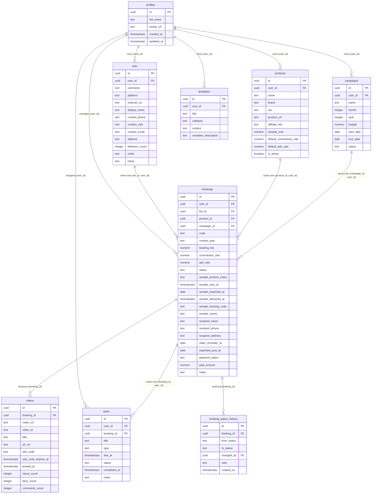

# Tài liệu Thiết kế Cơ sở Dữ liệu (Database Design) - KOL Manager

> **LƯU Ý QUAN TRỌNG (REVIEW ONLY)**:
> - Tài liệu này đặc tả kiến trúc cơ sở dữ liệu đã qua rà soát, vá lỗi bảo mật sở hữu chéo (Same-Owner FKs) và chuẩn hóa dữ liệu.
> - Script SQL tương ứng được lưu tại [`docs/database-schema.sql`](file:///Users/admin/kol-manager/docs/database-schema.sql).
> - **CHƯA THỰC THI SQL TRÊN SUPABASE**: Script và thiết kế này dành riêng cho việc rà soát và kiểm duyệt trước khi chạy migration thực tế.

---

## 1. Tổng quan Kiến trúc Dữ liệu (Database Overview)

Ứng dụng **KOL Manager** được xây dựng trên nền tảng **PostgreSQL (Supabase)**. Hệ thống được thiết kế theo mô hình thực thể quan hệ chuẩn hóa (Normalized Relational Database Model), giải quyết triệt để các nhược điểm của việc quản lý bằng Spreadsheet phẳng (trùng lặp dữ liệu, dữ liệu kiểu text không đồng nhất, nguy cơ tham chiếu chéo dữ liệu giữa các người dùng).

### Các nguyên tắc thiết kế cốt lõi

1. **Chuẩn hóa thực thể (Entity-Centric)**: Tách riêng các đối tượng nghiệp vụ độc lập: *KOL/KOC*, *Sản phẩm (Products)*, *Chiến dịch (Campaigns)*, *Hợp tác (Bookings)*, *Video nghiệm thu (Videos)*, *Lịch công việc (Tasks)* và *Văn mẫu (Templates)*.
2. **Dữ liệu cấu trúc thay vì text tự do**:
   - `booking_fee`, `paid_amount`, `budget`, `sample_cost`: Kiểu số tiền tệ (`NUMERIC(15,2)`), đơn vị VNĐ.
   - `commission_rate`, `ads_rate`: Kiểu phần trăm số (`NUMERIC(5,2)`), có ràng buộc giới hạn từ `0` đến `100`.
   - Ngày tháng/thời gian: Lưu `DATE` hoặc `TIMESTAMPTZ` chuẩn ISO, phục vụ lọc và nhắc việc tự động.
3. **Quản lý vận hành thực tế (Real-world Operations)**:
   - Tích hợp thông tin vận chuyển hàng mẫu trực tiếp trong `bookings` (`recipient_name`, `recipient_phone`, `recipient_address`, `sample_tracking_code`, `sample_carrier`).
   - Tách riêng `videos` với ngày hết hạn của mã quảng cáo (`ads_code_expires_at`) và hỗ trợ nhiều video cho một booking.
4. **Bảo mật & Phân quyền cấp dòng (Row Level Security - RLS)**:
   - Mọi bảng đều bật RLS (`ENABLE ROW LEVEL SECURITY`).
   - Mọi thực thể gốc đều có trường `user_id` liên kết `profiles.id` (thông qua `auth.users`).
   - Sử dụng cú pháp tối ưu hiệu năng `(SELECT auth.uid())` để PostgreSQL cache scalar subquery trong phiên truy vấn.
5. **Ràng buộc sở hữu cùng người dùng cấp độ CSDL (Same-Owner Database Enforcement)**:
   - Thay vì chỉ dựa vào RLS ở tầng API/Client, hệ thống **bắt buộc** ràng buộc sở hữu ở cấp độ Schema:
     - Thêm ràng buộc `UNIQUE (id, user_id)` trên các bảng cha: `kols`, `products`, `campaigns`, `bookings`.
     - Chuyển các khóa ngoại trong `bookings` thành khóa ngoại phức hợp (composite foreign keys):
       - `(kol_id, user_id) REFERENCES kols(id, user_id)`
       - `(product_id, user_id) REFERENCES products(id, user_id)`
       - `(campaign_id, user_id) REFERENCES campaigns(id, user_id)`
     - Tương tự trong bảng `tasks`:
       - `(booking_id, user_id) REFERENCES bookings(id, user_id)`
   - **Bảo đảm toán học ở tầng DB**: Một booking của User A không thể nào liên kết tới KOL, Sản phẩm hay Chiến dịch của User B, ngay cả khi RLS bị tắt hoặc API gửi sai ID.
6. **Nhật ký trạng thái chỉ đọc (Audit-Only Status History)**:
   - Bảng `booking_status_history` là nhật ký kiểm toán không thể bị giả mạo.
   - Client/Frontend **hoàn toàn không có quyền** `INSERT`, `UPDATE`, hay `DELETE`.
   - Chỉ duy nhất Database Trigger `SECURITY DEFINER` được phép tự động ghi lịch sử khi cột `bookings.status` thay đổi.

---

## 2. Danh sách các Thực thể (Entity List - Đúng 9 Bảng)

Hệ thống duy trì chính xác **9 bảng cốt lõi**:

| STT | Bảng | Mục đích |
| :---: | :--- | :--- |
| 1 | **`profiles`** | Hồ sơ tài khoản người dùng ứng dụng (mở rộng từ `auth.users`). |
| 2 | **`kols`** | Danh bạ KOL / KOC, kênh mạng xã hội và thông tin liên hệ. |
| 3 | **`products`** | Danh mục sản phẩm mẫu, hoa hồng và chi phí sản phẩm. |
| 4 | **`campaigns`** | Chiến dịch theo tháng hoặc các đợt Mega Sale để quản lý ngân sách và gom nhóm booking. |
| 5 | **`bookings`** | **Thực thể trung tâm** đại diện cho một hợp đồng/lần hợp tác giữa KOL và Sản phẩm trong Chiến dịch. |
| 6 | **`booking_status_history`** | Nhật ký vết lịch sử kiểm toán (Audit Log) theo dõi chuyển trạng thái của từng booking. |
| 7 | **`videos`** | Danh sách video đăng tải thực tế, lưu trữ Link Air và Spark Ads Code kèm thời hạn. |
| 8 | **`tasks`** | Lịch trình công việc, nhắc nhở gửi hàng, giục video, xin mã Ads, thanh toán. |
| 9 | **`templates`** | Kho văn mẫu (tin nhắn mời, gửi brief, giục video,...) hỗ trợ biến thay thế dạng text. |

---

## 3. Sơ đồ Quan hệ Thực thể (ERD)



---

## 4. Chi tiết Đặc tả Bảng & Cột (Table & Column Definitions)

### 4.1. Bảng `profiles`
Lưu trữ thông tin người dùng ứng dụng, mở rộng 1-1 từ bảng `auth.users` của Supabase Auth.

| Tên cột | Kiểu dữ liệu | Ràng buộc | Mô tả |
| :--- | :--- | :--- | :--- |
| `id` | `UUID` | PK, REFERENCES `auth.users(id)` ON DELETE CASCADE | ID người dùng, trùng với `auth.uid()`. |
| `full_name` | `TEXT` | NULL | Tên hiển thị của người dùng. |
| `avatar_url` | `TEXT` | NULL | Đường dẫn ảnh đại diện. |
| `created_at` | `TIMESTAMPTZ` | NOT NULL, DEFAULT `now()` | Thời gian tạo tài khoản. |
| `updated_at` | `TIMESTAMPTZ` | NOT NULL, DEFAULT `now()` | Thời gian cập nhật hồ sơ gần nhất. |

- **Trigger**: `trigger_profiles_updated_at` tự động cập nhật `updated_at = now()` khi có lệnh UPDATE.
- **Tự động khởi tạo**: Trigger `on_auth_user_created` trên `auth.users` tự động tạo profile tương ứng.
- **Xử lý tài khoản cũ**: Cần chạy lệnh backfill một lần đối với người dùng đã tạo trước khi kích hoạt trigger.

---

### 4.2. Bảng `kols`
Lưu trữ danh bạ KOL / KOC. Mỗi bản ghi được sở hữu bởi một người dùng (`user_id`).

| Tên cột | Kiểu dữ liệu | Ràng buộc | Mô tả |
| :--- | :--- | :--- | :--- |
| `id` | `UUID` | PK, DEFAULT `gen_random_uuid()` | Khóa chính duy nhất. |
| `user_id` | `UUID` | NOT NULL, FK `profiles(id)` ON DELETE CASCADE | Chủ sở hữu bản ghi KOL. |
| `username` | `TEXT` | NOT NULL | Username trên mạng xã hội (VD: `@lananh_beauty`). |
| `platform` | `TEXT` | NOT NULL, DEFAULT `'tiktok'` | Nền tảng (`tiktok`, `facebook`, `instagram`, `youtube`, `shopee`). |
| `channel_url` | `TEXT` | NULL | Link trực tiếp tới trang cá nhân/kênh. |
| `display_name`| `TEXT` | NULL | Tên thường gọi/biệt danh của KOL. |
| `contact_phone` | `TEXT` | NULL | Số điện thoại liên lạc. |
| `contact_zalo` | `TEXT` | NULL | Số hoặc link kết nối Zalo. |
| `contact_email` | `TEXT` | NULL | Email công việc. |
| `address` | `TEXT` | NULL | Địa chỉ nhận hàng mặc định của KOL. |
| `followers_count`| `INTEGER` | DEFAULT `0`, **CHECK (`followers_count >= 0`)** | Số lượng người theo dõi (không âm). |
| `niche` | `TEXT` | NULL | Ngành hàng (Beauty, Haircare, Lifestyle, Food,...). |
| `notes` | `TEXT` | NULL | Đánh giá phong cách làm việc, lưu ý cá nhân. |
| `created_at` | `TIMESTAMPTZ` | NOT NULL, DEFAULT `now()` | Thời gian tạo. |
| `updated_at` | `TIMESTAMPTZ` | NOT NULL, DEFAULT `now()` | Thời gian cập nhật. |
| **Constraint 1** | `UNIQUE` | `(user_id, platform, username)` | Chống trùng username trên cùng 1 nền tảng của 1 user. |
| **Constraint 2** | `UNIQUE` | `(id, user_id)` | **Khóa phức hợp phục vụ Same-Owner FK cho `bookings`**. |

---

### 4.3. Bảng `products`
Danh mục sản phẩm của shop/brand mang đi hợp tác hoặc gửi mẫu.

| Tên cột | Kiểu dữ liệu | Ràng buộc | Mô tả |
| :--- | :--- | :--- | :--- |
| `id` | `UUID` | PK, DEFAULT `gen_random_uuid()` | Khóa chính sản phẩm. |
| `user_id` | `UUID` | NOT NULL, FK `profiles(id)` ON DELETE CASCADE | Chủ sở hữu sản phẩm. |
| `name` | `TEXT` | NOT NULL | Tên sản phẩm (VD: *Combo Gội Xả CHESY 1000ml*). |
| `brand` | `TEXT` | NULL | Tên nhãn hàng (VD: *CHESY*). |
| `sku` | `TEXT` | NULL | Mã sản phẩm nội bộ để đối soát kho. |
| `product_url` | `TEXT` | NULL | Link sản phẩm (TikTok Shop / Shopee / Website). |
| `affiliate_link` | `TEXT` | NULL | Link affiliate để KOL gắn giỏ hàng. |
| `sample_cost` | `NUMERIC(15,2)` | DEFAULT `0`, **CHECK (`sample_cost >= 0`)** | Giá vốn mẫu quà tặng (VNĐ). |
| `default_commission_rate` | `NUMERIC(5,2)` | DEFAULT `0`, **CHECK (`>= 0 AND <= 100`)** | Hoa hồng mặc định (%) (VD: `15.00`). |
| `default_ads_rate` | `NUMERIC(5,2)` | DEFAULT `0`, **CHECK (`>= 0 AND <= 100`)** | Tỉ lệ ngân sách ads mặc định (%) (VD: `7.00`). |
| `description` | `TEXT` | NULL | USP và điểm nổi bật để gửi cho KOL làm kịch bản. |
| `is_active` | `BOOLEAN` | NOT NULL, DEFAULT `true` | Trạng thái còn mở hợp tác hay không. |
| `created_at` | `TIMESTAMPTZ` | NOT NULL, DEFAULT `now()` | Thời gian tạo. |
| `updated_at` | `TIMESTAMPTZ` | NOT NULL, DEFAULT `now()` | Thời gian cập nhật. |
| **Constraint** | `UNIQUE` | `(id, user_id)` | **Khóa phức hợp phục vụ Same-Owner FK cho `bookings`**. |

---

### 4.4. Bảng `campaigns`
Gom nhóm các đợt booking theo tháng hoặc sự kiện để kiểm soát ngân sách.

| Tên cột | Kiểu dữ liệu | Ràng buộc | Mô tả |
| :--- | :--- | :--- | :--- |
| `id` | `UUID` | PK, DEFAULT `gen_random_uuid()` | Khóa chính chiến dịch. |
| `user_id` | `UUID` | NOT NULL, FK `profiles(id)` ON DELETE CASCADE | Chủ sở hữu chiến dịch. |
| `name` | `TEXT` | NOT NULL | Tên chiến dịch (VD: *Chiến dịch Tháng 9/2026*). |
| `month` | `INTEGER` | NULL, CHECK (`month >= 1 AND month <= 12`) | Tháng (1 - 12). |
| `year` | `INTEGER` | NULL, CHECK (`year >= 2020`) | Năm (VD: `2026`). |
| `budget` | `NUMERIC(15,2)` | DEFAULT `0`, **CHECK (`budget >= 0`)** | Ngân sách dự trù cho chiến dịch (VNĐ). |
| `start_date` | `DATE` | NULL | Ngày bắt đầu. |
| `end_date` | `DATE` | NULL | Ngày kết thúc. |
| `status` | `TEXT` | NOT NULL, DEFAULT `'active'`, CHECK IN (`'planning'`, `'active'`, `'completed'`, `'paused'`) | Trạng thái chiến dịch. |
| `notes` | `TEXT` | NULL | Mục tiêu chiến dịch. |
| `created_at` | `TIMESTAMPTZ` | NOT NULL, DEFAULT `now()` | Thời gian tạo. |
| `updated_at` | `TIMESTAMPTZ` | NOT NULL, DEFAULT `now()` | Thời gian cập nhật. |
| **Constraint** | `UNIQUE` | `(id, user_id)` | **Khóa phức hợp phục vụ Same-Owner FK cho `bookings`**. |

---

### 4.5. Bảng `bookings` (Thực thể trung tâm)
Đại diện cho một lần hợp tác cụ thể giữa KOL và Sản phẩm trong một Chiến dịch.

| Tên cột | Kiểu dữ liệu | Ràng buộc | Mô tả |
| :--- | :--- | :--- | :--- |
| `id` | `UUID` | PK, DEFAULT `gen_random_uuid()` | Khóa chính booking. |
| `user_id` | `UUID` | NOT NULL, FK `profiles(id)` ON DELETE CASCADE | Chủ sở hữu booking. |
| `kol_id` | `UUID` | NOT NULL | ID của KOL được book. |
| `product_id` | `UUID` | NULL | Sản phẩm hợp tác chính. |
| `campaign_id`| `UUID` | NULL | Thuộc chiến dịch nào. |
| `code` | `TEXT` | NULL | Mã booking gợi nhớ (VD: `BK-202609-001`). |
| `content_type` | `TEXT` | NULL | Thể loại video (Review, Unboxing, Kịch bản,...). |
| `booking_fee` | `NUMERIC(15,2)` | NOT NULL, DEFAULT `0`, **CHECK (`booking_fee >= 0`)** | Chi phí booking cứng (VNĐ). |
| `commission_rate` | `NUMERIC(5,2)` | DEFAULT `0`, **CHECK (`>= 0 AND <= 100`)** | % Hoa hồng chốt riêng (snapshot) cho booking. |
| `ads_rate` | `NUMERIC(5,2)` | DEFAULT `0`, **CHECK (`>= 0 AND <= 100`)** | % Ngân sách ads thỏa thuận (snapshot) cho booking. |
| `status` | `TEXT` | NOT NULL, DEFAULT `'contacted'`, CHECK IN (`'contacted'`, `'confirmed'`, `'sample_sent'`, `'sample_delivered'`, `'draft_submitted'`, `'posted'`, `'completed'`, `'cancelled'`) | Trạng thái tiến độ (8 trạng thái chuẩn hóa). |
| `sample_product_notes` | `TEXT` | NULL | Chi tiết quà/mẫu gửi kèm. |
| `sample_sent_at` | `TIMESTAMPTZ` | NULL | Thời gian thực tế gửi hàng mẫu đi. |
| `sample_expected_at` | `DATE` | NULL | Ngày dự kiến KOL nhận được mẫu. |
| `sample_delivered_at` | `TIMESTAMPTZ` | NULL | Thời gian KOL nhận hàng thành công. |
| `sample_tracking_code`| `TEXT` | NULL | Mã vận đơn giao hàng mẫu (GHTK, ViettelPost...). |
| `sample_carrier` | `TEXT` | NULL | Đơn vị vận chuyển (GHTK, Viettel Post, J&T,...). |
| `recipient_name` | `TEXT` | NULL | Tên người nhận hàng (có thể khác tên KOL). |
| `recipient_phone`| `TEXT` | NULL | SĐT người nhận hàng mẫu. |
| `recipient_address`| `TEXT` | NULL | Địa chỉ nhận hàng của booking này. |
| `video_reminder_at` | `DATE` | NULL | **Mốc deadline tham chiếu nhanh để nhắc làm video**. |
| `expected_post_at` | `DATE` | NULL | Deadline cam kết đăng video chính thức. |
| `payment_status` | `TEXT` | NOT NULL, DEFAULT `'unpaid'`, CHECK IN (`'unpaid'`, `'partially_paid'`, `'paid'`) | Trạng thái thanh toán phí booking. |
| `paid_amount` | `NUMERIC(15,2)` | NOT NULL, DEFAULT `0`, **CHECK (`paid_amount >= 0`)** | Số tiền đã thực thanh toán (VNĐ). |
| `notes` | `TEXT` | NULL | Ghi chú trao đổi thêm. |
| `created_at` | `TIMESTAMPTZ` | NOT NULL, DEFAULT `now()` | Ngày tạo booking. |
| `updated_at` | `TIMESTAMPTZ` | NOT NULL, DEFAULT `now()` | Ngày cập nhật gần nhất. |
| **Constraint 1** | `UNIQUE` | `(id, user_id)` | Khóa phức hợp phục vụ Same-Owner FK cho `tasks`. |
| **FK Same-Owner 1** | `FOREIGN KEY` | `(kol_id, user_id) REFERENCES kols(id, user_id) ON DELETE RESTRICT` | **Ngăn triệt để chọn KOL của user khác**. |
| **FK Same-Owner 2** | `FOREIGN KEY` | `(product_id, user_id) REFERENCES products(id, user_id) ON DELETE SET NULL (product_id)` | **Ngăn triệt để chọn sản phẩm của user khác**. |
| **FK Same-Owner 3** | `FOREIGN KEY` | `(campaign_id, user_id) REFERENCES campaigns(id, user_id) ON DELETE SET NULL (campaign_id)` | **Ngăn triệt để chọn chiến dịch của user khác**. |

---

### 4.6. Bảng `booking_status_history` (Audit-Only)
Nhật ký vết lịch sử kiểm toán ghi nhận mọi lần đổi trạng thái của Booking.

> **QUY TẮC BẢO MẬT & KIỂM TOÁN**:
> - **Audit-Only**: Bảng chỉ có quyền `SELECT` cho chủ sở hữu của booking.
> - **Không cho phép ghi từ Client**: Tuyệt đối không cấp quyền `INSERT`, `UPDATE`, hay `DELETE` cho người dùng thông thường.
> - **Chỉ trigger ghi**: Dữ liệu chỉ được sinh tự động thông qua Database Trigger `SECURITY DEFINER` (`trigger_log_booking_status`) mỗi khi cột `bookings.status` thay đổi.

| Tên cột | Kiểu dữ liệu | Ràng buộc | Mô tả |
| :--- | :--- | :--- | :--- |
| `id` | `UUID` | PK, DEFAULT `gen_random_uuid()` | Khóa chính nhật ký. |
| `booking_id` | `UUID` | NOT NULL, FK `bookings(id)` ON DELETE CASCADE | Liên kết với booking được đổi trạng thái. |
| `from_status` | `TEXT` | NULL | Trạng thái trước khi đổi (NULL nếu lần đầu tạo). |
| `to_status` | `TEXT` | NOT NULL | Trạng thái mới chuyển sang. |
| `changed_by` | `UUID` | NULL, FK `profiles(id)` ON DELETE SET NULL | Người thực hiện (lấy từ `auth.uid()`). |
| `note` | `TEXT` | NULL | Ghi chú lý do chuyển trạng thái. |
| `created_at` | `TIMESTAMPTZ` | NOT NULL, DEFAULT `now()` | Thời điểm chính xác xảy ra sự thay đổi. |

---

### 4.7. Bảng `videos`
Quản lý các video đăng tải thực tế trả về từ Booking (hỗ trợ nhiều video trên 1 booking).

| Tên cột | Kiểu dữ liệu | Ràng buộc | Mô tả |
| :--- | :--- | :--- | :--- |
| `id` | `UUID` | PK, DEFAULT `gen_random_uuid()` | Khóa chính video. |
| `booking_id` | `UUID` | NOT NULL, FK `bookings(id)` ON DELETE CASCADE | Thuộc booking nào. |
| `video_url` | `TEXT` | NULL | Link video chính thức đã public trên kênh. |
| `video_id` | `TEXT` | NULL | ID video của TikTok (VD: `7281938291029381923`). |
| `title` | `TEXT` | NULL | Tiêu đề hoặc caption của video. |
| `air_url` | `TEXT` | NULL | Link file gốc không logo / Link Air (Drive, CapCut,...). |
| `ads_code` | `TEXT` | NULL | Mã ủy quyền Spark Ads Code. |
| `ads_code_expires_at` | `TIMESTAMPTZ` | NULL | **Ngày hết hạn của Code Ads** để chủ động xin gia hạn. |
| `posted_at` | `TIMESTAMPTZ` | NULL | Thời gian video chính thức được đăng tải. |
| `views_count` | `INTEGER` | DEFAULT `0`, **CHECK (`views_count >= 0`)** | Lượt xem video (không âm). |
| `likes_count` | `INTEGER` | DEFAULT `0`, **CHECK (`likes_count >= 0`)** | Lượt thích video (không âm). |
| `comments_count`| `INTEGER` | DEFAULT `0`, **CHECK (`comments_count >= 0`)** | Lượt bình luận (không âm). |
| `notes` | `TEXT` | NULL | Ghi chú thêm về video. |
| `created_at` | `TIMESTAMPTZ` | NOT NULL, DEFAULT `now()` | Thời gian tạo. |
| `updated_at` | `TIMESTAMPTZ` | NOT NULL, DEFAULT `now()` | Thời gian cập nhật. |

---

### 4.8. Bảng `tasks`
Các công việc nhắc nhở, to-do list được sinh ra tự động từ tiến độ Booking hoặc tạo thủ công.

| Tên cột | Kiểu dữ liệu | Ràng buộc | Mô tả |
| :--- | :--- | :--- | :--- |
| `id` | `UUID` | PK, DEFAULT `gen_random_uuid()` | Khóa chính công việc. |
| `user_id` | `UUID` | NOT NULL, FK `profiles(id)` ON DELETE CASCADE | Chủ sở hữu công việc. |
| `booking_id` | `UUID` | NULL | Liên kết với booking (nếu có). |
| `title` | `TEXT` | NOT NULL | Tên công việc (VD: *Kiểm tra bưu tá giao hàng cho @lananh*). |
| `type` | `TEXT` | NOT NULL, DEFAULT `'general'`, CHECK IN (`'sample_delivery_check'`, `'video_reminder'`, `'draft_review'`, `'get_air_link'`, `'get_ads_code'`, `'payment'`, `'general'`) | Phân loại task nhắc việc. |
| `due_at` | `TIMESTAMPTZ` | NOT NULL | Thời hạn hoàn thành công việc. |
| `status` | `TEXT` | NOT NULL, DEFAULT `'pending'`, CHECK IN (`'pending'`, `'completed'`, `'cancelled'`) | Trạng thái công việc. |
| `completed_at`| `TIMESTAMPTZ` | NULL | Thời điểm đánh dấu hoàn thành. |
| `notes` | `TEXT` | NULL | Ghi chú chi tiết công việc. |
| `created_at` | `TIMESTAMPTZ` | NOT NULL, DEFAULT `now()` | Thời gian tạo. |
| `updated_at` | `TIMESTAMPTZ` | NOT NULL, DEFAULT `now()` | Thời gian cập nhật. |
| **FK Same-Owner** | `FOREIGN KEY` | `(booking_id, user_id) REFERENCES bookings(id, user_id) ON DELETE CASCADE` | **Bảo đảm task và booking liên kết phải cùng user_id**. |

---

### 4.9. Bảng `templates`
Kho văn mẫu phục vụ việc sao chép tin nhắn trao đổi với KOL.

| Tên cột | Kiểu dữ liệu | Ràng buộc | Mô tả |
| :--- | :--- | :--- | :--- |
| `id` | `UUID` | PK, DEFAULT `gen_random_uuid()` | Khóa chính văn mẫu. |
| `user_id` | `UUID` | NOT NULL, FK `profiles(id)` ON DELETE CASCADE | Chủ sở hữu văn mẫu. |
| `title` | `TEXT` | NOT NULL | Tên mẫu (VD: *Mời hợp tác gội xả*, *Nhắc video sát deadline*). |
| `category` | `TEXT` | NOT NULL, DEFAULT `'invitation'`, CHECK IN (`'invitation'`, `'confirmation'`, `'brief'`, `'sample_sent'`, `'video_reminder'`, `'ads_code_request'`, `'feedback'`, `'general'`) | Phân loại văn mẫu. |
| `content` | `TEXT` | NOT NULL | Nội dung mẫu chứa biến text: `{{kol_name}}`, `{{product_name}}`, `{{commission_rate}}`, `{{ads_rate}}`, `{{deadline}}`,... |
| `variables_description` | `TEXT` | NULL | Hướng dẫn các biến sử dụng trong mẫu. |
| `created_at` | `TIMESTAMPTZ` | NOT NULL, DEFAULT `now()` | Thời gian tạo. |
| `updated_at` | `TIMESTAMPTZ` | NOT NULL, DEFAULT `now()` | Thời gian cập nhật. |

---

## 5. Quy trình Trạng thái Booking (Status Workflow)

Quy trình tiến độ hợp tác được thiết kế linh hoạt với **8 trạng thái** chuẩn hóa. Đặc biệt, **`DRAFT_SUBMITTED` là trạng thái TÙY CHỌN (Optional)**, phản ánh chính xác thực tế vận hành:

```
[1. CONTACTED] 
       ↓ (KOL đồng ý hợp tác)
[2. CONFIRMED]
       ↓ (Shop đóng gói & gửi quà mẫu)
[3. SAMPLE_SENT]
       ↓ (Bưu tá giao thành công / KOL báo nhận mẫu)
[4. SAMPLE_DELIVERED]
       ├──→ [6. POSTED] (Lên video trực tiếp — áp dụng khi không yêu cầu duyệt nháp)
       └──→ [5. DRAFT_SUBMITTED] (Gửi video nháp duyệt trước)
                   ↓ (Shop duyệt kịch bản & hình ảnh)
            [6. POSTED] (KOL đăng video chính thức lên kênh)
       ↓ (Nghiệm thu Link Air, Spark Ads Code & thanh toán đủ)
[7. COMPLETED]

* Trạng thái hủy kèo / sự cố:
[8. CANCELLED] (Có thể chuyển sang trạng thái này từ BẤT KỲ trạng thái nào phía trên)
```

### Chi tiết các trạng thái:
1. **`contacted` (Đang liên hệ)**: Đã nhắn tin mời hợp tác, đang chờ phản hồi hoặc đang đàm phán giá/hoa hồng.
2. **`confirmed` (Đã chốt deal)**: Hai bên đã thống nhất chi phí, sản phẩm và điều khoản; đã gửi Brief hướng dẫn nội dung.
3. **`sample_sent` (Đã gửi hàng mẫu)**: Đã tạo đơn vận chuyển, có mã vận đơn (`sample_tracking_code`), hàng đang di chuyển.
4. **`sample_delivered` (KOL đã nhận mẫu)**: Hàng đã giao thành công. Bắt đầu kích hoạt đồng hồ đếm ngược deadline làm video.
5. **`draft_submitted` (Đã gửi video duyệt - TÙY CHỌN)**: KOL gửi bản dựng nháp trước khi đăng.
   - *Lưu ý*: Trạng thái này **KHÔNG BẮT BUỘC**. Rất nhiều hợp tác tặng quà hoặc brief mở cho phép KOL lên thẳng video mà không cần duyệt nháp.
6. **`posted` (Đã lên video)**: Video đã xuất hiện công khai trên kênh của KOL, có link video chính thức.
7. **`completed` (Hoàn tất nghiệm thu)**: Đã thu thập đủ Link Air (video gốc sạch), Code Spark Ads và hoàn tất thanh toán tiền booking (`payment_status = 'paid'`).
8. **`cancelled` (Hủy hợp tác)**: KOL từ chối, bùng video, hàng giao không thành công hoặc hủy thỏa thuận giữa chừng.
   - *Lưu ý*: Có thể chuyển sang `cancelled` từ bất kỳ bước nào trong tiến trình.

> **Kiểm soát chuyển trạng thái**: Được xử lý linh hoạt tại **Application Layer (Next.js)** nhằm đáp ứng các tình huống nghiệp vụ thực tế, không dùng database transition trigger cứng để tránh gây nghẽn luồng thao tác.

---

## 6. Phân định Trách nhiệm Nhắc nhở Video (`video_reminder_at` vs `tasks`)

Hệ thống duy trì song song cả trường `bookings.video_reminder_at` và bảng `tasks`:

| Trường / Bảng | Mục đích nghiệp vụ | Vai trò kỹ thuật |
| :--- | :--- | :--- |
| **`bookings.video_reminder_at`** | **Mốc hạn chót tham chiếu nhanh (Quick Reference Deadline)** | Là cột kiểu `DATE` nằm trực tiếp trên bản ghi booking. Cho phép hiển thị ngay trên bảng danh sách booking hoặc Kanban Card mà không cần thực hiện phép `JOIN`. Hỗ trợ filter nhanh các booking sắp đến ngày cần liên hệ lại. |
| **`tasks`** | **Bản ghi công việc hành động (Actionable To-do Record)** | Là thực thể độc lập có trạng thái vòng đời (`pending`, `completed`, `cancelled`), thời gian chi tiết (`due_at`), ghi chú xử lý. Một booking có thể sinh ra nhiều task khác nhau (nhắc gửi hàng, giục video lần 1, giục video lần 2, lấy mã ads). |

Cả hai trường/bảng đều được giữ lại vì bổ trợ hoàn hảo cho nhau giữa góc nhìn tổng quan (Overview) và góc nhìn thực thi chi tiết (Action Item).

---

## 7. Thiết kế Phân quyền & Bảo mật (Row Level Security - RLS)

### Nguyên tắc RLS
1. Mọi bảng đều bật `ALTER TABLE ... ENABLE ROW LEVEL SECURITY;`.
2. Áp dụng chuẩn hiệu năng cao: **Sử dụng `(SELECT auth.uid())`** để PostgreSQL cache subquery trong session:
   ```sql
   CREATE POLICY "Users can manage own kols" ON public.kols
     FOR ALL
     USING ((SELECT auth.uid()) = user_id)
     WITH CHECK ((SELECT auth.uid()) = user_id);
   ```

### Chính sách theo từng nhóm bảng:
- **Bảng trực tiếp (`kols`, `products`, `campaigns`, `bookings`, `tasks`, `templates`)**:
  - Quyền `FOR ALL`: `(SELECT auth.uid()) = user_id` cho cả `USING` và `WITH CHECK`.
- **Bảng `profiles`**:
  - `FOR SELECT`: `(SELECT auth.uid()) = id`.
  - `FOR UPDATE`: `(SELECT auth.uid()) = id`.
- **Bảng `videos`**:
  - Kế thừa quyền qua `bookings`: Người dùng chỉ có quyền quản lý video thuộc booking của chính mình:
    ```sql
    USING (
      EXISTS (
        SELECT 1 FROM public.bookings
        WHERE bookings.id = videos.booking_id
          AND bookings.user_id = (SELECT auth.uid())
      )
    )
    ```
- **Bảng `booking_status_history` (AUDIT-ONLY)**:
  - `FOR SELECT`: Cho phép xem lịch sử của các booking thuộc sở hữu của mình:
    ```sql
    USING (
      EXISTS (
        SELECT 1 FROM public.bookings
        WHERE bookings.id = booking_status_history.booking_id
          AND bookings.user_id = (SELECT auth.uid())
      )
    )
    ```
  - **TUYỆT ĐỐI KHÔNG CẤP** chính sách `INSERT`, `UPDATE`, hay `DELETE` cho client. Mọi bản ghi chỉ được sinh từ Trigger `SECURITY DEFINER`.

---

## 8. Chiến lược Đánh chỉ mục (Index Strategy)

Được tối ưu để hỗ trợ cả ràng buộc khóa ngoại phức hợp (Same-Owner Composite FKs) lẫn các truy vấn lọc thường xuyên:

1. **Chỉ mục Khóa ngoại & Khóa phức hợp**:
   - `kols(user_id)`
   - `products(user_id)`
   - `campaigns(user_id)`
   - `bookings(user_id)`
   - `bookings(kol_id, user_id)` *(Phục vụ foreign key join & cascade check)*
   - `bookings(product_id, user_id)` *(Phục vụ foreign key join & cascade check)*
   - `bookings(campaign_id, user_id)` *(Phục vụ foreign key join & cascade check)*
   - `booking_status_history(booking_id)`
   - `videos(booking_id)`
   - `tasks(user_id)`
   - `tasks(booking_id, user_id)` *(Phục vụ foreign key join & cascade check)*
   - `templates(user_id)`

2. **Chỉ mục Phục vụ Truy vấn Nghiệp vụ (Operational Indexes)**:
   - `kols(user_id, platform, username)`: Tìm kiếm KOL theo nền tảng.
   - `bookings(user_id, status)`: Lọc booking theo tiến độ trên Kanban.
   - `bookings(user_id, expected_post_at)`: Lọc booking sắp đến hạn đăng bài.
   - `tasks(user_id, status, due_at)`: Lọc task quá hạn hoặc cần làm trong ngày.
   - `videos(ads_code)` (Partial index `WHERE ads_code IS NOT NULL`): Tra cứu mã quảng cáo.
   - `videos(ads_code_expires_at)` (Partial index `WHERE ads_code_expires_at IS NOT NULL`): Lọc mã ads sắp hết hạn.

---

## 9. Quản lý Khởi tạo Profile & Safe Migration

### Trigger tự động tạo Profile
Khi một người dùng đăng ký tài khoản qua Supabase Auth (`auth.users`), trigger `on_auth_user_created` sẽ tự động khởi tạo một bản ghi tương ứng trong `public.profiles`:

```sql
CREATE OR REPLACE FUNCTION public.handle_new_user()
RETURNS TRIGGER AS $$
BEGIN
  INSERT INTO public.profiles (id, full_name, avatar_url)
  VALUES (
    NEW.id,
    COALESCE(NEW.raw_user_meta_data->>'full_name', NEW.raw_user_meta_data->>'name', NEW.email),
    NEW.raw_user_meta_data->>'avatar_url'
  )
  ON CONFLICT (id) DO NOTHING;
  RETURN NEW;
END;
$$ LANGUAGE plpgsql SECURITY DEFINER SET search_path = public;
```

### Kịch bản Backfill người dùng hiện có (One-time Backfill)
Đối với các tài khoản đã được tạo trước khi áp dụng trigger (ví dụ tài khoản test đã tạo ở Bước 1-3), khi chạy migration thực tế sẽ thực hiện câu lệnh backfill an toàn:

```sql
INSERT INTO public.profiles (id, full_name, avatar_url)
SELECT
  id,
  COALESCE(raw_user_meta_data->>'full_name', raw_user_meta_data->>'name', email),
  raw_user_meta_data->>'avatar_url'
FROM auth.users
ON CONFLICT (id) DO NOTHING;
```

### Tiêu chuẩn an toàn khi chạy Migration (Safe Migration Patterns)
- Script SQL tuân thủ tính lũy thừa (Idempotency):
  - Dùng `CREATE TABLE IF NOT EXISTS`.
  - Dùng `CREATE INDEX IF NOT EXISTS`.
  - Dùng `CREATE OR REPLACE FUNCTION`.
  - Dùng `DROP TRIGGER IF EXISTS ... ON ...; CREATE TRIGGER ...`.
  - Dùng `DROP POLICY IF EXISTS ... ON ...; CREATE POLICY ...`.
- Không sử dụng các câu lệnh phá hủy (`DROP TABLE CASCADE`) gây mất dữ liệu hiện có.

---

## 10. Bảng Đối soát Chuyển đổi Dữ liệu (Spreadsheet → Database Mapping)

| Nguồn Sheet | Cột trên Sheet gốc | Bảng & Cột mới trong Database | Ghi chú chuyển đổi & Chuẩn hóa |
| :--- | :--- | :--- | :--- |
| **DATA / WKF** | `STT` | Bỏ qua | Dùng `id` (UUID) hoặc số thứ tự hiển thị tự động trên giao diện UI. |
| **DATA / WKF** | `Tháng` / `Month` | `campaigns.month` & `campaigns.name` | Gom vào chiến dịch theo tháng (VD: Chiến dịch Tháng 8/2026). |
| **DATA / WKF** | `username KOL` | `kols.username` & `bookings.kol_id` | Tạo bản ghi KOL trước, booking chỉ lưu khóa ngoại `kol_id`. |
| **DATA / WKF** | `Link kênh` / `TikTok URL`| `kols.channel_url` | Lưu 1 lần duy nhất tại bảng `kols`, không lặp lại ở từng booking. |
| **DATA / WKF** | `Booking fee` | `bookings.booking_fee` | Chuyển thành số nguyên `NUMERIC` (VD: `2000000`). |
| **DATA / WKF** | `CMS` / `Commission rate` | `bookings.commission_rate` | Tách riêng phần trăm hoa hồng (VD: `12.00`). |
| **WKF** | `Ads rate` | `bookings.ads_rate` | Tách riêng phần trăm ngân sách ads (VD: `7.00`). |
| **DATA / WKF** | `Content Type` | `bookings.content_type` | Lưu thể loại video (Review, Vlog, Unboxing,...). |
| **DATA / WKF** | `Sản phẩm hợp tác` | `products.name` & `bookings.product_id` | Tạo sản phẩm chuẩn trong `products`, booking gắn `product_id`. |
| **DATA / WKF** | `Thời gian gửi sample` | `bookings.sample_sent_at` | Chuyển chuỗi ngày tháng sang `TIMESTAMPTZ`. |
| **DATA / WKF** | `Ngày dự kiến nhận mẫu` | `bookings.sample_expected_at` | Kiểu `DATE`. |
| **WKF** | `Contact / shipping info` | `bookings.recipient_name, phone, address` | Lưu thông tin người nhận và địa chỉ giao hàng mẫu. |
| **DATA / WKF** | `Thời gian nhắc video` | `bookings.video_reminder_at` & `tasks` | Lưu ngày nhắc trên booking và tạo task nhắc việc cụ thể. |
| **DATA / WKF** | `Thời gian đăng` / `Posting date` | `bookings.expected_post_at` | Lưu deadline dự kiến lên video của KOL. |
| **DATA / WKF** | `Tiến độ hợp tác KOC` | `bookings.status` | Chuẩn hóa sang 8 trạng thái hệ thống (`sample_sent`, `posted`,...). |
| **AIR / DATA** | `Link Air` | `videos.air_url` | Tách sang bảng `videos`, liên kết qua `booking_id`. |
| **AIR / DATA** | `Code Ads` | `videos.ads_code` | Tách sang bảng `videos`, có thể kèm `ads_code_expires_at`. |
| **LINK AIR** | `Ngày đăng` | `videos.posted_at` | Thời gian video thực tế lên sóng. |
| **LINK AIR** | `Link video` | `videos.video_url` | Đường link TikTok chính thức của video. |
| **LINK AIR** | `ID video` | `videos.video_id` | Mã ID định danh video của nền tảng. |
| **DATA / WKF** | `Note` | `bookings.notes` | Ghi chú tự do cho booking. |
| **VĂN MẪU** | Các đoạn tin nhắn mẫu | `templates.content` & `category` | Lưu vào bảng `templates`, sử dụng biến `{{kol_name}}`, `{{product_name}}`. |
